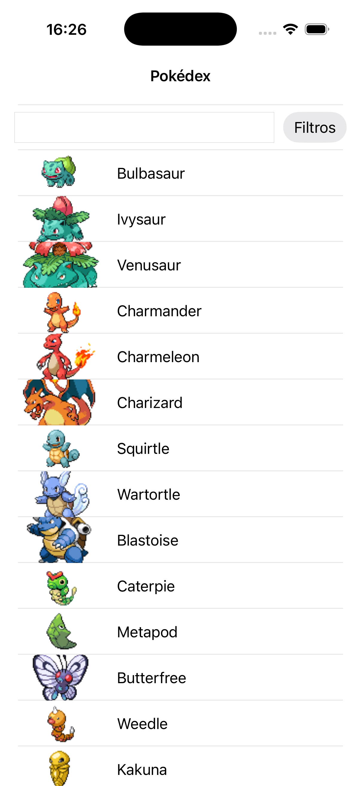
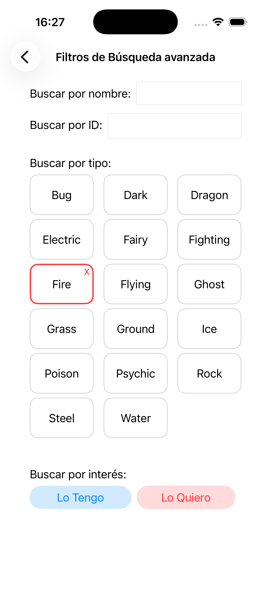
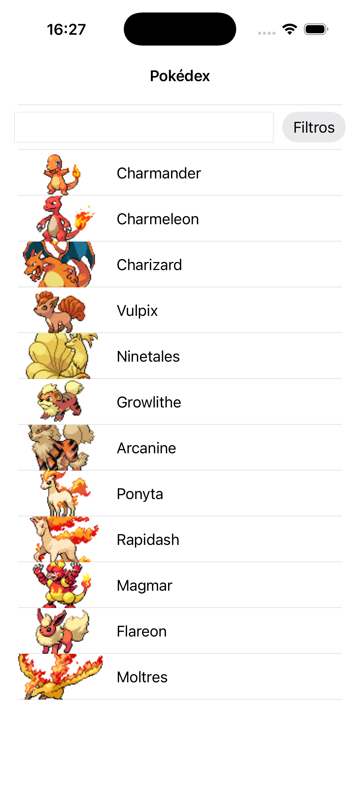

# Pokedex iOS

Aplicación nativa desarrollada con **Swift y UIKit** para explorar Pokémon, consultar su información y organizar una colección personal.

  
  
  
  

> Proyecto formativo durante mis prácticas en Plexus Tech, bajo la mentoría de un desarrollador iOS senior. Desarrollado para profundizar en el leguaje Swift, aplicando una arquitectura desacoplada, componentes reutilizables, accesibilidad y pruebas automatizadas.

## ¿Qué permite hacer?

La pantalla principal muestra un catálogo de Pokémon obtenido mediante [PokeAPI](https://pokeapi.co/). Desde ella se puede:

* Explorar el listado de Pokémon.
* Buscar Pokémon por nombre en tiempo real.
* Aplicar filtros por nombre, identificador, tipo y estado de colección.
* Clasificar cada Pokémon como **conseguido**, **deseado** o **sin clasificar**.
* Acceder al detalle de cualquier Pokémon.

En la pantalla de detalle se muestra su nombre, identificador, descripción, tipos y una galería de imágenes. Al pulsar dos veces sobre una imagen se abre una pantalla independiente que permite verla ampliada.

La galería y la pantalla de zoom son componentes reutilizables creados con XIB.

## Accesibilidad

La galería está adaptada para su uso con **VoiceOver**. Cuando esta opción está activa, el desplazamiento horizontal se sustituye por controles que permiten avanzar o retroceder entre las imágenes de forma accesible.

La interfaz también admite los ajustes de tamaño de texto configurados en el dispositivo.

## Stack

`Swift` · `UIKit` · `XIB` · `MVVM` · `Coordinators` · `Dependency Injection` · `Combine` · `Swift Testing`

La aplicación utiliza una arquitectura **MVVM** para separar la interfaz de la lógica de presentación. Los Coordinators gestionan la navegación y la inyección de dependencias mediante protocolos reduce el acoplamiento y facilita las pruebas.
